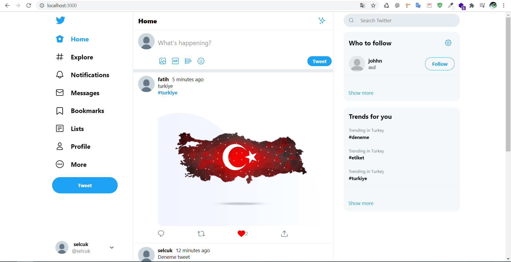
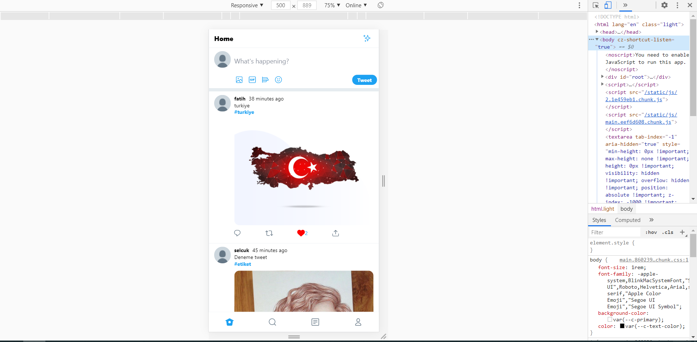
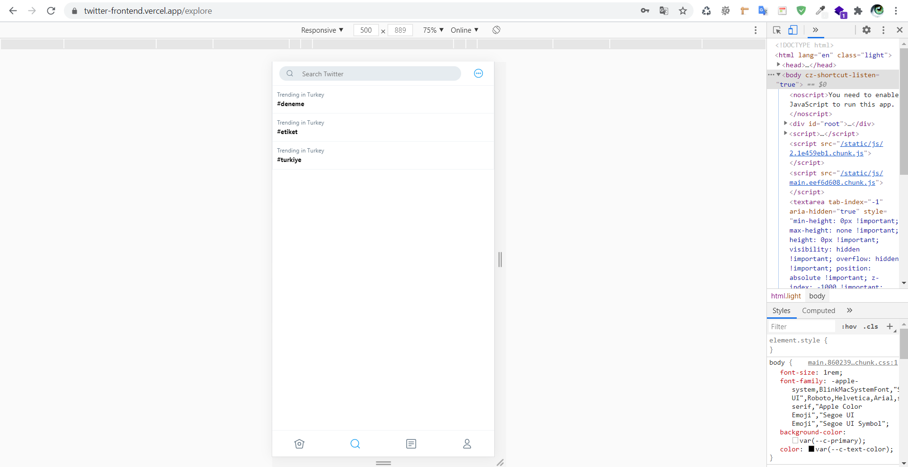
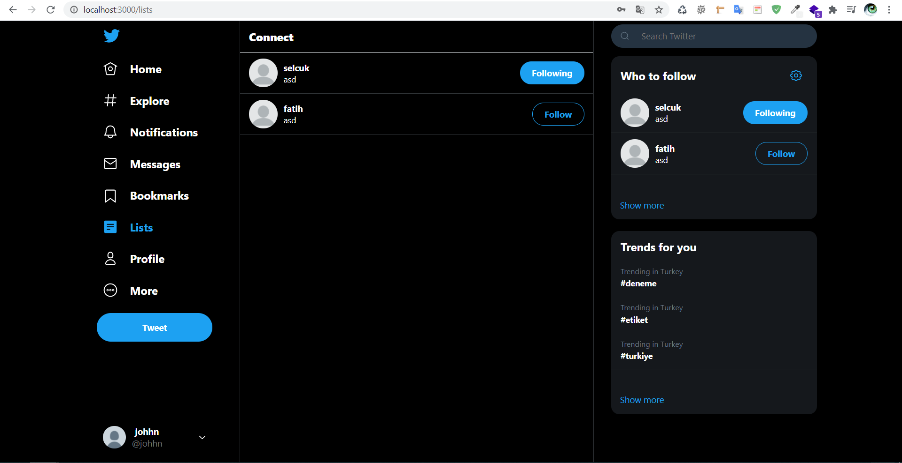
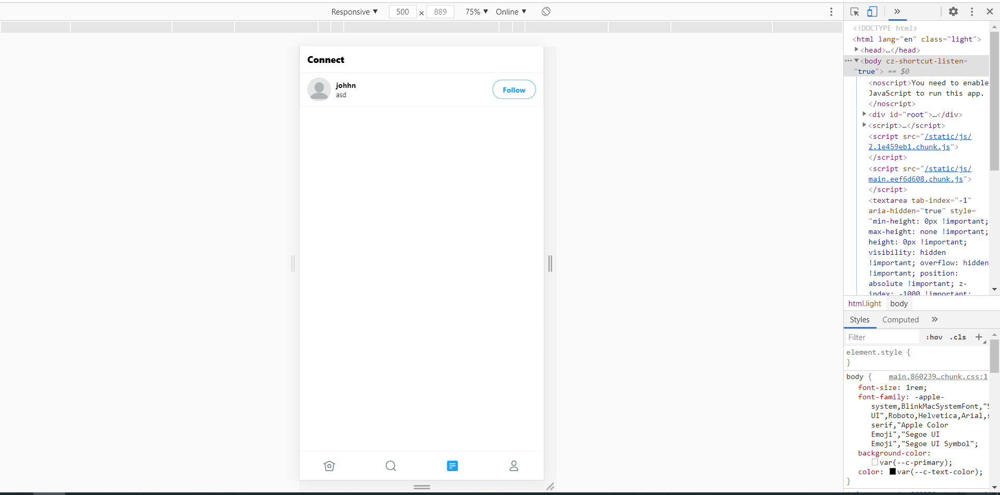
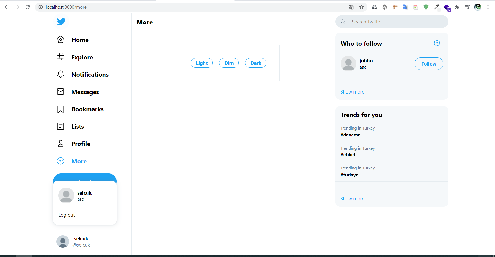

## Twitter Clone Frontend
 - Live: https://twitter-frontend.vercel.app/

Twitter clone using MERN stack (Mongo, Express, React, Node).

This is the backend repository. If you are looking for the frontend repository, [click here](https://github.com/scozdev/twitter-frontend)

## :rocket: Tech Stack

- NodeJs
- Express
- MongoDB
- Mongoose

## :warning: Prerequisite

- node
- npm
- mongodb

## :scroll: Todo

- [x] Login/Signup
- [x] New tweet
- [x] Like
- [x] Comment
- [x] View Profile
- [x] Light theme / Dim theme / Dark theme
- [x] Search
- [x] Edit Profile
- [x] Retweet

## :cd: How to run local

At the root of your project create an .env file with the following contents:

```javascript
JWT_SECRET=<YOUR_SECRET>
JWT_EXPIRE=30d // or any reasonable value that you prefer
MONGOURI=<YOUR_DB_CONNECTION_URI>
```

```
- npm install  
- npm run start
```

## UI

### Home





### Explore




### Lists





### More



### Profile


